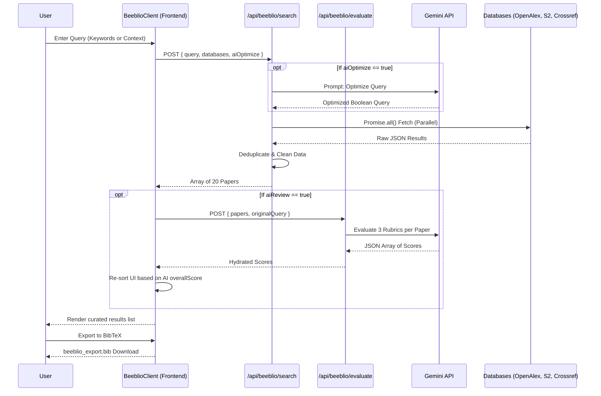

# Beeblio: AI-Powered Scientific Paper Search & Review

## 1. Overview
Beeblio is an intelligent literature review app that enhances the traditional academic search experience by layering Large Language Models (LLMs) on top of standard scientific databases. 
Instead of relying solely on exact keyword matches, Beeblio understands research context, optimizes search queries automatically, and acts as an AI reviewer to rank and highlight the most relevant literature.

## 2. Architecture & Tech Stack
- **Framework**: Next.js 14+ (App Router)
- **Styling**: Tailwind CSS + Framer Motion (for micro-animations) + Radix UI (Shadcn UI)
- **AI Integration**: `@google/generative-ai` (Gemini 2.5 Flash/Pro)
- **Data Sources**: OpenAlex API, Crossref API, Semantic Scholar API

## 3. System Workflow (Architecture Diagram)

## 3. Core Features & AI Layers
### 3.1. Input Mechanism
Users can provide search parameters via a tabbed interface:
- **Keywords**: Traditional comma-separated or short phrase input.
- **Research Context**: A text area where users can paste an abstract, a research proposal, or rough ideas.

### 3.2. Layer 1: Query Optimization (Pre-Search)
- **Function**: Translates raw user input (especially lengthy "Research Context") into highly optimized Boolean queries or precise keywords for the target databases.
- **Toggle**: Can be disabled if the user wants strict control over their exact keywords.

### 3.3. Layer 2: Results Review (Post-Search)
- **Function**: Processes the raw JSON output from the databases. The AI reads titles, abstracts, and metadata, comparing them against the user's original intent/context.
- **Output**: 
  - Assigns a Relevance Score.
  - Highlights highly recommended papers with a distinctive visual badge (e.g., ✨ "AI Recommended").
  - Sorts the final aggregated list based on this AI score rather than default database sorting.
- **Toggle**: Can be disabled to see raw, unfiltered results from the databases.

### 3.4. Database Aggregation
- Users can select which databases to search (OpenAlex, Crossref, Semantic Scholar).
- The app fetches results concurrently (`Promise.all`) to ensure speed.

## 4. UI/UX Design Specifications
- **Aesthetics**: Premium, academic yet modern feel. Use glassmorphism for sticky headers/settings panels. Subtle gradient backgrounds for the "AI Recommended" elements.
- **Components**:
  - `HeroSection`: Title and brief description.
  - `SearchInterface`: Contains Tabs (Keywords vs Context), Settings Popover/Accordion, and the main Search input/button.
  - `SettingsPanel`: Toggles for "Optimize Queries" and "AI Review", Checkboxes for Databases.
  - `ResultsFeed`: A list of `PaperCard`s.
  - `PaperCard`: Displays Title, Authors, Year, Citations, Source. Expandable section for the Abstract. Distinctive glowing border or badge for AI-recommended papers.

## 6. Phased Execution Plan
### Phase 1: Foundation & UI Construction
- [x] Register app in `apps.ts`.
- [x] Build the static UI components in `src/app/beeblio/page.tsx` (Search bar, settings, mock paper cards).
- [x] Establish React state for inputs and toggles.

### Phase 2: Database Integrations
- [x] Create fetching utilities for OpenAlex, Crossref, and Semantic Scholar.
- [x] Integrate parallel fetching logic into Server APIs (`src/app/api/beeblio/search/route.ts`).

### Phase 3: AI Layers (Gemini)
- [x] Implement Layer 1 (Query Optimization) in Search API.
- [x] Implement Layer 2 (Results Review) in Evaluate API (`src/app/api/beeblio/evaluate/route.ts`).
- [x] Add developer fallback logic for API Quota (429) errors.
- [x] Wire the UI to trigger these APIs based on toggle states.

### Phase 4: Polish & Export
- [x] Add Framer Motion animations for cards entering the screen and dynamic layout sorting.
- [x] Fix mobile responsiveness (grid layouts, text wrapping).
- [x] Implement an Export feature (BibTeX format) directly from the client.